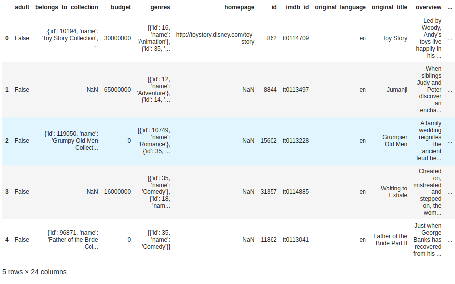

# Movies-ETL
Using the Extract, Transform, Load (ETL) process to create data pipelines.
 
## Background
The client is interested in developing an algorithm to predict which low budget movies being relesae will become popular so they can buy the movie rights at a lower price.
 
### Purpose
 
The purpose of this analysis is to to create an automated pipeline that takes in new data, performs the appropriate transformations, and loads the data into existing tables. You’ll need to refactor the code from this module to create one function that takes in the three files—Wikipedia data, Kaggle metadata, and the MovieLens rating data—and performs the ETL process by adding the data to a PostgreSQL database.
 
 
 
## Resources
 
Data source:
- (1)movies_metadata.csv, (2)ratings.csv, (3)wikipedia_movies.json
 
Software:
- PostgreSQL 14.0, PgAdmin 4, Python 3.7.6, Visual Studio Code 1.68.1
 
 
 
## Overview of Analysis
 
Deliverable 1: Using Python, Pandas, the ETL process, and code refactoring, we wrote a function that read in the three data files and creates three separate DataFrames, as shown in Fig 1.1 - 1.3

 

#### Figure 1.1 wiki_movies_df

 

#### Figure 1.2 kaggle_metadata_df

 

#### Figure 1.3 ratings_df

 

Deliverable 2: Using Python, Pandas, the ETL process, and code refactoring - we extracted and transformed the Wikipedia data and then merged it with the Kaggle metadata. While extracting the IMDb IDs using a regular expression string and dropping duplicates, we used a try-except block to catch errors. (Fig 1.4 - 1.5)

 

.png)

#### Figure 1.4 wiki_movies_df.head()

 

.png)

#### Figure 1.5 wiki_movies_df.columns.to_list()

 

Deliverable 3: Using your knowledge of Python, Pandas, the ETL process, and code refactoring - extracted and transformed the Kaggle metadata and MovieLens rating data, then converted the transformed data into separate DataFrames. Then, we mergeed the Kaggle metadata DataFrame with the Wikipedia movies DataFrame to create the movies_df DataFrame. Finally, we merged the MovieLens rating data DataFrame with the movies_df DataFrame to create the movies_with_ratings_df. (Fig 1.6 - 1.7)

 

#### Figure 1.6 movies_with_ratings_df.head()

 

.png)

#### Figure 1.7 movies_df.head()

 

Deliverable 4: Using Python, Pandas, the ETL process, code refactoring, and PostgreSQL we added the movies_df DataFrame and MovieLens rating CSV data to a SQL database tables movies and raitings. (Fig 1.8 - 1.9)

 

#### Figure 1.8 movies_query

 

 

#### Figure 1.8 ratings_query
 
 
 
## Summary
 
- In this project we were able to use Python, Pandas, the ETL process, code refactoring, and PostgreSQL to create an algorithm that extracted, and transformed the data into DataFrames and then loaded them into a SQL database.
 
 
 
## References
 
[Markdown](https://docs.github.com/en/get-started/writing-on-github/getting-started-with-writing-and-formatting-on-github/basic-writing-and-formatting-syntax)
 
[Postgresql Database Connection](https://www.postgresql.org/docs/current/libpq-connect.html)
 
[SQLAlchemy](https://www.sqlalchemy.org/)
